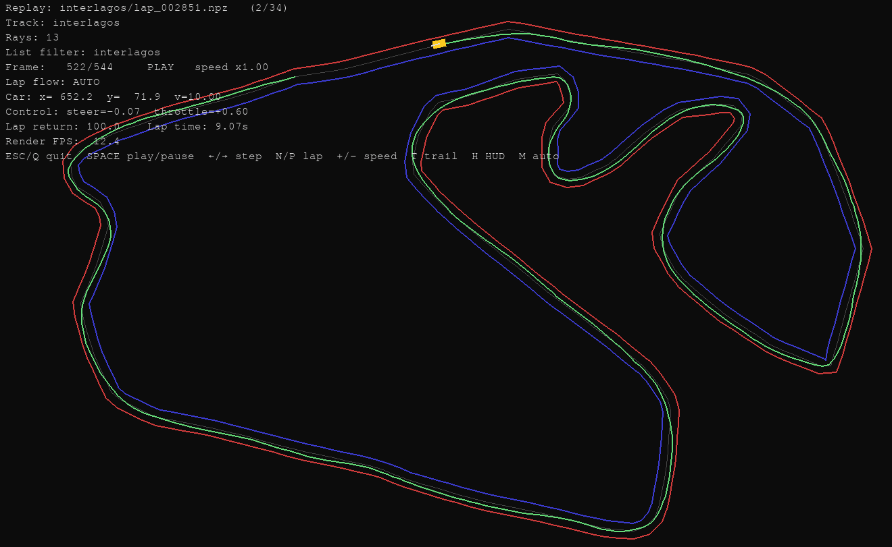

# RL Racing Car (PPO)

A 2D reinforcement learning racing project with:
- PPO training (`agent.py`)
- kinematic car environment + ray sensors (`car_env.py`)
- configurable track generation (`track.py`)
- live training visualizer (`train.py`)
- lap replay viewer (`replay.py`)

## Features

- Near + lookahead ray observations
- Centreline-based lookahead probe for corner information
- Multiple track presets: `oval`, `monaco`, `spa`
- Lap replay logging to compressed `.npz`
- Keyboard controls for training and replay

## Setup

Use your existing conda env (example):

```bash
conda activate car
```

Install dependencies (if needed):

```bash
pip install numpy pygame torch
```

## Train

```bash
python train.py --track spa
```

Useful args:
- `--num-rays`
- `--max-steer-delta`
- `--max-throttle-delta`
- `--lookahead-dist`

## Replay laps

```bash
python replay.py --dir replays --track auto --track-filter all
```

Examples:

```bash
python replay.py --dir replays --track spa --track-filter spa
python replay.py --dir replays --lap 1
```

## Controls

### Training (`train.py`)
- `ESC` / `Q`: quit + save
- `S`: save checkpoint
- `F`: toggle fast mode
- `R`: reset episode

### Replay (`replay.py`)
- `ESC` / `Q`: quit
- `SPACE`: pause/resume
- `←` / `→`: step frame (paused)
- `N` / `P`: next/previous lap
- `+` / `-`: playback speed
- `T`: trail
- `H`: HUD
- `M`: auto-advance laps

## Repository structure

- `agent.py`: PPO network + update logic
- `car_env.py`: environment, reward, sensors, collisions
- `track.py`: track definitions and geometry helpers
- `train.py`: rollout + PPO training loop + recorder
- `replay.py`: offline lap playback viewer

## Example (GIF)

A trained car going around Interlagos.




